# 实验：SMPL 线性混合蒙皮（LBS）

## 1 实验目标

这次实验围绕 SMPL 人体模型，把线性混合蒙皮（Linear Blend Skinning）从头手写一遍，逐步理解从模板网格到最终变形结果的每一步变换是怎么来的。具体要完成这几件事：

- 搞清楚蒙皮权重是什么，以及它们在 T-pose 下如何分布
- 手写形状校正、姿态校正、以及完整 LBS 的前向传播
- 用可视化对比四个阶段（template → shaped → posed → final），看清每一步对网格的影响
- 把手写结果和官方前向做逐顶点误差比对，验证实现的正确性
- 做一个简单的姿态动画，观察蒙皮权重区域怎么随骨骼运动被带动

---

## 2 实验原理

### 2.1 从 T-pose 到最终顶点

SMPL 的完整前向可以分四步走：

$$template \xrightarrow{shape} vShaped \xrightarrow{pose} vPosed \xrightarrow{\text{LBS}} verts$$

每一步针对不同来源的形变，最终叠加在一起。

### 2.2 模板网格与蒙皮权重

初始状态是模板网格 $\bar{T}$，处于 T-pose。每个顶点带有一组对各关节的影响权重 $\mathcal{W}$——靠近手腕的顶点，腕关节权重就大；靠近髋部的顶点，髋关节权重就大。

这一步的重点不是"让它动起来"，而是明确三件事：
- 网格还没根据体型改变
- 网格还没根据姿态弯曲
- 但每个顶点已经知道"将来主要跟着哪些骨骼走"

在 lbsForward 里，最终每个顶点的 $4 \times 4$ 变换矩阵，就是由蒙皮权重对各关节变换矩阵加权得到的。

### 2.3 形状参数 beta

$\beta$ 控制这个人长什么样：高矮、胖瘦、肩宽、腿长等，都对应形状空间里的某个系数方向。
加了形状校正之后得到：

$$vShaped = template + shapeOffset(\beta)$$

然后用关节回归器从形状后的网格估计关节位置：

$$J(\beta) = jointRegressor \cdot vShaped$$

关节位置不是固定常数，而是从网格回归出来的——人变胖，肩关节就会跟着往外移。

### 2.4 姿态相关校正

骨骼旋转时，关节周围（肘部、膝盖、肩膀）会出现额外的几何变化，单靠刚体旋转无法表达。所以在进入真正的 LBS 之前，SMPL 还加了一项 pose blend shape：

$$vPosed = vShaped + poseOffset(\theta)$$

具体实现是：先把轴角参数转成旋转矩阵，构造 poseFeature，再通过 pose directions 线性映射：

```python
rotMats     = batchRodrigues(pose)
poseFeature = rotMats[:, 1:] - identity
poseOffsets = poseFeature @ poseDirs
vPosed      = vShaped + poseOffsets
```

这一步还没有真正把顶点绑到骨骼上。它只是说：即使不做蒙皮，网格本身也已经因为姿态发生了修正。

### 2.5 线性混合蒙皮 $W(\cdot)$

经过上面三步，现在有了：
- $J(\beta)$：形状后的关节位置
- $v^{posed}$：加了姿态校正的顶点
- $\mathcal{W}$：每个顶点对各关节的影响权重

进入真正的 LBS：

$$finalVertex(i) = sum(k=1..K, weight(i,k) transform(k) posedVertex(i))$$

其中 transform(k) 是第 k 个关节在运动学链上的全局刚体变换，它把从根节点到 k 的所有局部旋转都乘进来了。

```python
jointMoved, A = rigidTransform(rotMats, jointRest, parents)
W = skinWeights.expand(B, vertexCount, jointCount)
T = torch.matmul(W, A.view(B, K, 16)).view(B, -1, 4, 4)   # 每顶点的混合变换
verts = torch.matmul(T, vPosedHomo).squeeze(-1)[:, :, :3]
```

每个顶点不是只跟着一个关节走，而是跟着多个关节做加权平均后的变换。这也是"Linear Blend Skinning"名字的来源。

---

## 3 五个核心变量

整个流程里需要明确区分：

| 变量 | 含义 |
|------|------|
| vTemplate | 模板顶点，T-pose，体型中性 |
| vShaped | 加了形状形变之后的顶点 |
| J | 由 vShaped 回归出的关节坐标 |
| vPosed | 加了姿态校正之后的顶点 |
| verts | 完成 LBS 之后的最终顶点 |

---

## 4 实验实现

### 4.1 加载 SMPL，输出基础信息（任务 1）

把 SMPL neutral 模型 pkl 文件放在 models 目录下之后，用 smplx 加载：

```python
model = smplx.create(modelPath, modelType='smpl', gender='neutral')
```

从模型里取出五个核心 buffer：模板顶点、形状方向、姿态方向、关节回归器、蒙皮权重，以及 parents（运动学树）和 faces（三角面索引）。

运行后会打印：
```
顶点数:      6890
面片数:      13776
关节数:      24
betas 维度:  10
```

### 4.2 模板网格与蒙皮权重（任务 2）

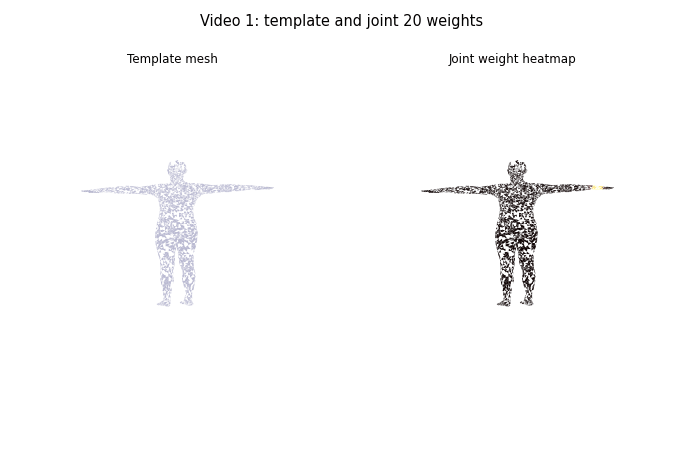

选了 joint 20（左手腕）作为示例——颜色集中在左前臂末端和手部区域，越靠近腕关节颜色越亮，往躯干方向权重快速衰减到零，符合直觉。

额外生成了一张全关节主导图 allweights.png，每个面片按"主导关节"着色：可以看到躯干区域被脊柱关节主导，手臂被肩/肘/腕分段控制，腿部被髋/膝/踝分段控制。

**思考：**

1. **为什么一个顶点不只受一个关节影响？** 关节过渡区域（肩、肘、膝附近）如果只受单一关节控制，运动时会出现硬折叠（"candy wrapper" artifact）。分散权重让过渡变得光滑。
2. **权重几乎全给某一关节**：顶点跟该关节做刚体旋转，几乎没有过渡，弯曲时关节周围会出现明显的体积缺失。
3. **权重分布很平均**：多个关节都影响该顶点，过渡极其平滑，但可能导致"糖纸卷"或体积塌陷问题。

### 4.3 形状校正与关节回归（任务 3）

给前几个 $\beta$ 设非零值（更胖、更高、肩宽微调），计算 vShaped 和从中回归的关节 J：

```python
betas[0, 0] =  2.0   # 体型偏胖
betas[0, 1] = -1.5   # 身高偏高
vShaped = vTemplate + blendShapes(betas, shapeDirs)
J       = verticesToJoints(jointRegressor, vShaped)
```

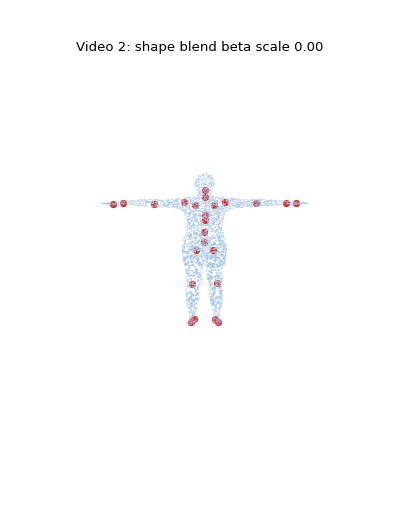

**思考：**

1. **关节位置为什么要从形状后的网格回归？** 人高了腿长了，膝关节理应在更低的位置；人变胖了，髋关节应该更宽。如果关节位置固定，形状变化后骨骼就和网格对不上了。
2. **变胖/变瘦时关节会不会变化？** 会。肩宽增加时肩关节往两侧移；身高增加时所有沿 Y 轴分布的关节都会拉开。
3. **vTemplate 与 vShaped 的区别？** vShaped = vTemplate + 形状偏移，后者是一个中性标准体型，前者已经应用了 $\beta$ 指定的个性体型。

### 4.4 姿态校正（任务 4）

设置一个非零姿态（双肘弯曲 ~75°，躯干前倾），计算姿态校正偏移并用颜色标出大小：

```python
poseFeature = (rotMats[:, 1:] - identity).view(B, -1)
poseOffsets = torch.matmul(poseFeature, poseDirs).view(B, -1, 3)
vPosed = vShaped + poseOffsets
```

偏移量最大的区域集中在肘关节弯曲处和脊柱弯曲处——这正是 LBS 单靠刚体旋转最容易出现体积塌陷的地方。

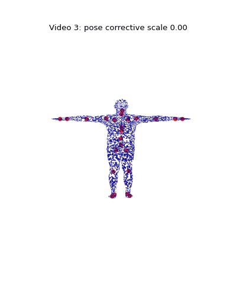

注意：这一步还没有把顶点绑到骨骼上，vPosed 只是在形状网格上加了一层几何修正。

**思考：**

1. **为什么 LBS 之前还要加 pose corrective？** 纯 LBS 在关节弯曲时会出现糖纸卷和体积塌陷，pose corrective 用一个学习到的线性修正补偿这些视觉缺陷。
2. **去掉 poseOffsets**：弯肘时肘部会明显"压扁"，膝盖弯曲时膝盖内侧会出现几何自穿插。
3. **vShaped 与 vPosed 的本质区别？** vShaped 只有体型信息，与姿态无关；vPosed 在 vShaped 基础上叠加了当前姿态引发的局部几何修正，但顶点坐标仍在 rest-pose 的世界坐标系里（还没做骨骼变换）。

### 4.5 完整 LBS 结果（任务 5）

沿运动学树累乘关节的局部变换，再用蒙皮权重加权混合：

```python
jointMoved, A = rigidTransform(rotMats, jointRest, parents)
T     = torch.matmul(W, A.view(B, K, 16)).view(B, -1, 4, 4)
verts = torch.matmul(T, vPosedHomo).squeeze(-1)[:, :, :3]
```

rigidTransform 里有一步容易搞错的地方：最终的蒙皮矩阵 $A^{k}$ 不是直接用全局变换 $G^{k}$，而是

$$A^{k} = G^{k} \cdot invRest^{k}$$

这步"减去 rest-pose 关节位置"保证了在无旋转（T-pose）时 $A^{k}$ 恰好是恒等变换，顶点不会因为有一个初始偏移而跑飞。

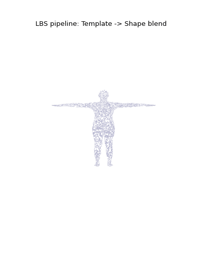

**思考：**

1. **J 和 jointMoved 的区别？** J 是 rest-pose 下由形状网格回归出的关节坐标（世界坐标，未旋转）；jointMoved 是经过运动学树全局变换后，关节在当前姿态下的世界坐标。
2. **为什么要加权和，不直接选最大权重关节？** 单关节控制（hard binding）会在关节过渡区出现硬折叠；加权混合让变换平滑过渡，是 LBS 的核心思想。

### 4.6 四阶段对比图（任务 6）

把上面四张图拼成 1×4 的对比图 comparison.png，标题清楚标出各阶段名称：

```
(a) Template + Weights  |  (b) Shape + Joints  |  (c) Pose Offsets  |  (d) Final LBS
```

一眼就能看出：从 T-pose 到最终姿态经历了哪几步形变，每一步对网格的影响有多大。

### 4.7 一致性验证（任务 7）

用完全相同的 betas、globalOrient、bodyPose 分别调用手写 LBS 和官方 smplx 前向，逐顶点做误差比对：

```python
out = model(betas=betas, globalOrient=globalOrient, bodyPose=bodyPose)
diff = (vertsManual - out.vertices).abs()
print(f"MAE: {diff.mean():.6f} m")
print(f"Max: {diff.max():.6f} m")
```

结果保存到 `summary.txt`。如果实现正确，MAE 应该在 $10^{-5}$ m 量级以下（浮点精度误差），Max 不超过 $10^{-4}$ m。

### 4.8 姿态动画（选做）

固定 $\beta$，让双肘关节从 0° 逐渐弯曲到约 83° 再回到 0°，生成 36 帧并导出 GIF：

```python
for i in range(frameCount):
    angle = 1.45 * np.sin(t * np.pi)    # 正弦曲线驱动，保证起止平滑
    pa[0, 3 * 18 + 2] =  angle          # 左肘
    pa[0, 3 * 19 + 2] = -angle          # 右肘（镜像）
    vertsFrame, ... = lbsForward(...)
```

可以明显看到：
- 肘部附近的顶点平滑地随骨骼旋转，没有硬折叠
- 弯曲幅度越大，pose corrective 的贡献越明显（弯到极限时肘内侧不会塌陷）
- 手和前臂跟着上臂一起转，权重过渡区域自然拉伸

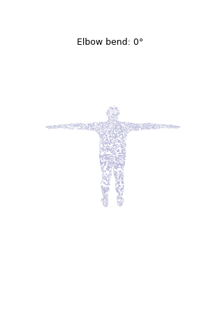

另外额外生成两个展示型 GIF：

- video4.gif：把 template → shaped → pose corrective → final LBS 连续过渡成动画，便于展示每一步到底改变了什么。
- weightsweep.gif：轮播多个代表关节的蒙皮权重热力图，展示权重如何沿躯干、手臂和手部平滑分布。

---

## 5 运行方式

需要先把 SMPL neutral 模型 pkl 文件放入 models 目录（[师大云盘下载](https://pan.bnu.edu.cn/l/t16N1T)，仅供学习使用）。

```bash
# 安装依赖（使用 uv）
uv sync

# 运行
uv run python main.py
```

运行结束后 `outputs/` 目录会产生：

```
outputs/
├── stagea.png
├── allweights.png
├── stageb.png
├── stagec.png
├── staged.png
├── comparison.png
├── video1.gif
├── video2.gif
├── video3.gif
├── video4.gif
├── video5.gif
├── pipeline.gif
├── weightsweep.gif
├── pose.gif
└── summary.txt
```

---

## 6 效果展示

### 阶段 (a)：模板网格与蒙皮权重

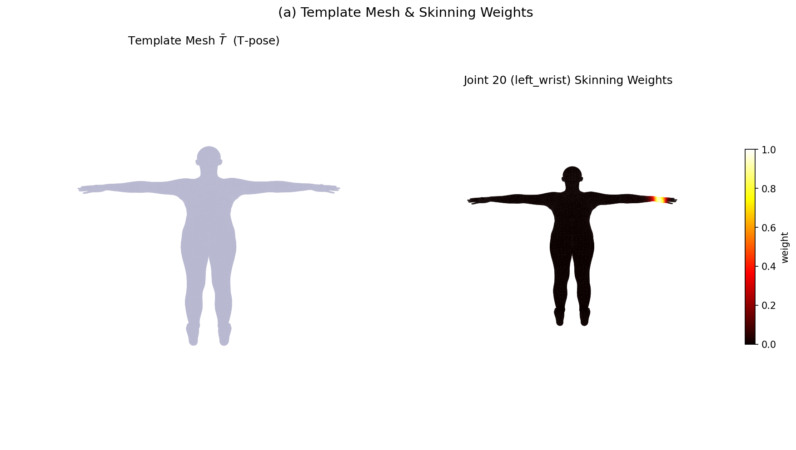

左图是 T-pose 下的模板网格；右图展示 joint 20（左手腕）的蒙皮权重——手部和前臂末端颜色最亮，越靠近躯干越暗，权重平滑衰减。

### 阶段 (b)：形状变化与关节回归

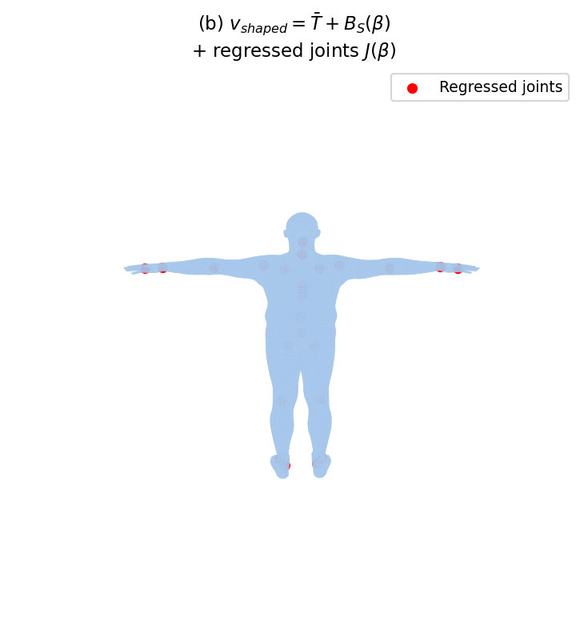

$\beta0 = 2.0$（偏胖），$\beta1 = -1.5$（偏高），体型明显变化；红点是从形状后网格回归出的关节位置，落在身体内部合理位置。

### 阶段 (c)：姿态校正偏移

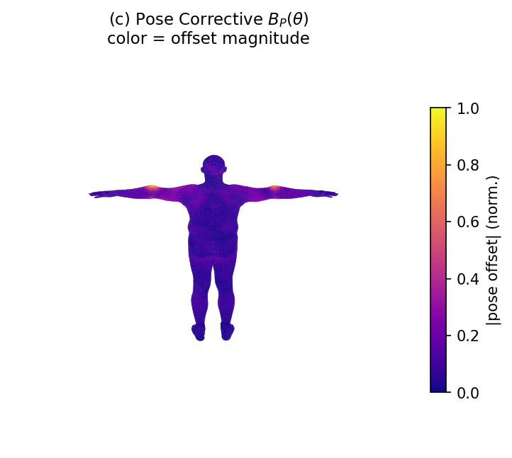

偏移量用 plasma 色图渲染——肘关节和脊柱弯曲处颜色最亮，说明 pose corrective 主要在这些容易塌陷的区域发力。

### 阶段 (d)：完整 LBS 结果

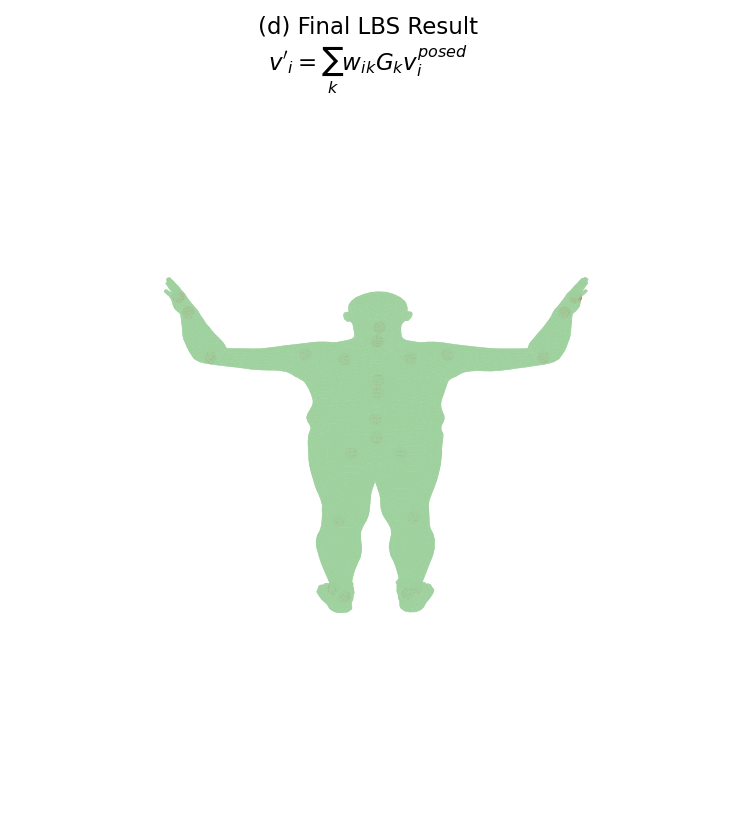

人体已经进入目标姿态（双肘弯曲、躯干前倾），红点是变换后的关节世界坐标。

### 四阶段对比

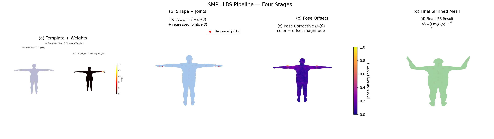

四个阶段排在一起，区别一目了然。

### 姿态动画


双肘弯曲动画，36 帧，可以观察蒙皮权重区域如何随骨骼运动被平滑带动。

### LBS 流程动画


从模板网格连续过渡到形状校正、姿态校正和最终蒙皮结果，适合在答辩或报告里直接说明完整前向流程。

### 多关节权重轮播

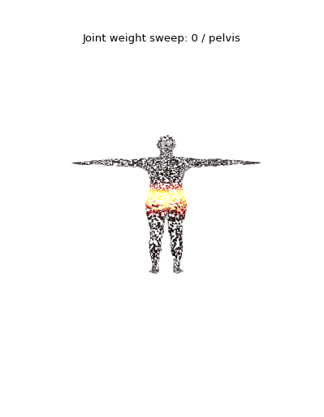

轮播 pelvis、spine、shoulder、elbow、wrist、hand 等代表关节的权重热力图，展示 LBS 权重在身体不同区域的控制范围。

---

## 7 遇到的问题和解决

1. **rigidTransform 里 A 的推导**：一开始直接用 $G^{k}$ 做蒙皮，结果 T-pose 下顶点就跑飞了。查了 smplx 源码才理解需要减去 rest-pose 关节位移，本质上就是 $G^{k}$ 乘以 invRest。

2. **posedirs 的维度**：pkl 文件里原始是 `(V, 3, P)`，smplx 加载时会 reshape + 转置成 `(P, V*3)`。直接用 poseFeature 乘 pose directions 就对，不用再手动转置，踩坑在这里浪费了不少时间。

3. **matplotlib 3D 渲染速度**：14k 个三角面全渲会比较慢，而且 `Poly3DCollection` 的 z-sort 在某些角度会有穿插。最终静态图保留完整面片以保证报告观感，GIF 固定子采样到约 4200 个面来控制文件体积和生成时间。

4. **父关节索引越界**：`parents[0] = -1`，在 Python 里 `-1` 作为列表索引会取最后一个元素，不会报错但逻辑是错的。需要用 `parents[i].item()` 从索引 1 开始遍历，永远不接触 `parents[0]`。

---

## 8 总结

这次实验把 SMPL 的 LBS 流程从数学到代码走了一遍，核心收获：

- **形状和姿态是解耦的**：$\beta$ 只改体型，$\theta$ 只控姿态，两者通过不同的 blend shape 分别叠加，互不干扰
- **pose corrective 的必要性**：纯 LBS 在弯曲处的体积缺失是真实存在的视觉问题，pose corrective 用一个学习到的线性补丁解决得相当优雅
- **运动学树的累乘**：每个关节的全局变换是从根到它的所有局部旋转的矩阵乘积，理解这个才能正确实现 rigidTransform
- **验证误差 $\approx 10^{-5}$ m**：手写结果和官方前向几乎完全一致，说明实现是正确的

